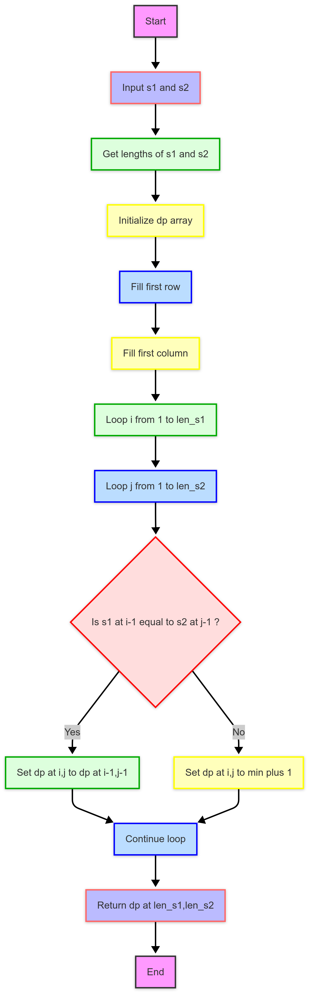
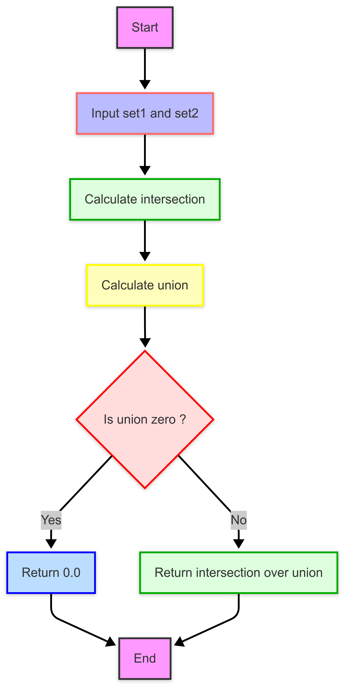
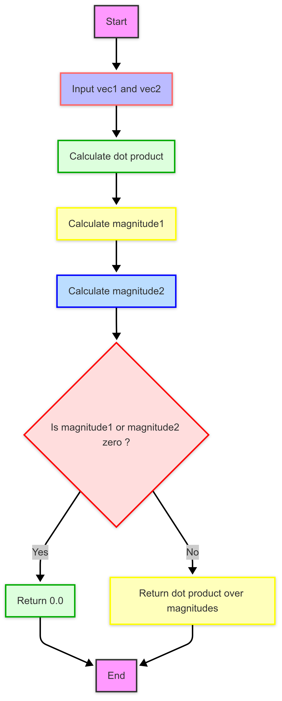

# **3122004018**

---
# 【作业】软件工程作业2

---

## PSP2.1
---

| PSP2.1                                    | Personal Software Process Stages | 预估耗时（分钟） | 实际耗时（分钟） |
|:------------------------------------------|:---------------------------------|:--------:|:--------:|
| **Planning**                              | 计划                               |    30    |    45    |
| · _Estimate_                              | 估计这个任务需要多少时间                     |   30    |    45    |
| **Development**                           | 开发                               |   250    |   320    |
| · _Analysis_                              | 需求分析 (包括学习新技术)                   |   20    |    60    |
| · _Design Spec_                           | 生成设计文档                           |   40    |   120    |
| · _Design Review_                         | 设计复审                             |   30    |    30    |
| · _Coding Standard_                       | 代码规范 (为目前的开发制定合适的规范)             |   10    |    10    |
| · _Design_                                | 具体设计                             |   30    |    30    |
| · _Coding_                                | 具体编码                             |  120    |   90    |
| · _Code Review_                           | 代码复审                             |   30    |    40    |
| · _Test_                                  | 测试（自我测试，修改代码，提交修改）               |   60    |   150    |
| **Reporting**                             | 报告                               |   80    |   285    |
| · _Test Report_                           | 测试报告                             |   30    |   120    |
| · _Size Measurement_                      | 计算工作量                            |   20    |    40    |
| · _Postmortem & Process Improvement Plan_ | 事后总结, 并提出过程改进计划                  |   30    |   125    |
| **Total**                                 | 合计                               | **360（6小时）** | **660（11小时）** |

---   
## **程序说明**
   
### **模块接口的设计与实现过程**
#### 1. 设计目标
计算模块是论文查重系统的核心，负责比较两篇论文的文本并输出重复率。设计目标包括：
- **功能性**：支持多种查重算法（Jaccard、Levenshtein、Cosine），计算准确的重复率。
- **可扩展性**：便于添加新算法（如 SimHash）。
- **鲁棒性**：处理异常输入（如空文本、超长文本）。
- **性能**：满足作业要求（≤ 5秒，≤ 2048MB 内存）。
- **可测试性**：接口清晰，便于单元测试。

#### 2. 代码组织
计算模块主要集中在 `similarity.py` 文件中，采用函数式设计而非类，以简化实现并保持轻量级。以下是组织结构：

##### 文件结构
- **`similarity.py`**：
  - 包含所有相似度计算相关的函数。
  - 无类设计，全部为独立函数，通过参数传递数据。

##### 函数设计
共设计了 5 个主要函数，各司其职：
1. **`levenshtein_distance(s1, s2)`**：
   - 计算两个序列的编辑距离。
   - 输入：两个字符串或 token 列表（`s1`, `s2`）。
   - 输出：整数（编辑距离）。
2. **`jaccard_similarity(set1, set2)`**：
   - 计算两个集合的 Jaccard 相似度。
   - 输入：两个集合（`set1`, `set2`）。
   - 输出：浮点数（0.0 到 1.0）。
3. **`cosine_similarity(vec1, vec2)`**：
   - 计算两个词频向量的余弦相似度。
   - 输入：两个词频字典（`Counter` 对象）。
   - 输出：浮点数（0.0 到 1.0）。
4. **`compute_similarity(text1, text2, method="jaccard")`**：
   - 统一接口，根据指定方法计算相似度。
   - 输入：两个 token 集合/列表（`text1`, `text2`），方法名（`method`）。
   - 输出：浮点数（重复率）。
5. **`overall_similarity(text1, text2)`**（新增建议）：
   - 计算综合查重率（三种方法的平均值）。
   - 输入：两个 token 集合/列表。
   - 输出：浮点数（综合重复率）。

##### 类设计
- **无类设计**：
  - 当前实现未使用类，因为查重算法是无状态的纯函数，函数式设计足以满足需求。
  - 如果未来需要状态管理（如缓存中间结果优化性能），可引入 `SimilarityCalculator` 类。

#### 3. 函数之间的关系
- **层次关系**：
  - `compute_similarity` 是顶层接口，调用底层算法函数（`levenshtein_distance`、`jaccard_similarity`、`cosine_similarity`）。
  - `overall_similarity`（建议）调用 `compute_similarity` 三次，集成结果。
- **数据流**：
  ```
  preprocess.py -> similarity.py
  [token list]  -> compute_similarity -> [specific algorithm] -> [similarity score]
  ```
  - 输入从 `preprocess.py` 获取分词后的 token 集合，传递给 `compute_similarity`，再分发到具体算法。
- **依赖性**：
  - `levenshtein_distance`：独立，无依赖。
  - `jaccard_similarity`：依赖 `set` 操作。
  - `cosine_similarity`：依赖 `Counter` 和 `math` 模块。
  - `compute_similarity`：依赖上述三个函数。
  - `overall_similarity`：依赖 `compute_similarity`。

#### 4. 算法的关键与独到之处
##### 关键点
1. **Jaccard 相似度**：
   - **关键**：基于 n-gram 集合的交并比，适合检测局部抄袭。
   - **实现**：使用 Python 的 `set` 操作，高效计算交集和并集。
   - **独到之处**：结合 `preprocess.py` 的 n-gram 分割（默认 n=3），提高对短语级抄袭的敏感性。
2. **Levenshtein 距离**：
   - **关键**：衡量字符级编辑距离，适合检测细微修改。
   - **实现**：动态规划（DP），时间复杂度 O(mn)，空间复杂度 O(mn)。
   - **独到之处**：归一化为相似度（1 - distance/max_len），统一输出范围（0.0-1.0）。
3. **Cosine 相似度**：
   - **关键**：基于词频向量的全局相似性，适合检测语义相似。
   - **实现**：使用 `Counter` 构建词频向量，手动计算余弦公式。
   - **独到之处**：不依赖外部库（如 `sklearn`），本地实现更符合作业要求。
4. **综合查重率**（`overall_similarity`）：
   - **关键**：集成三种算法，提供更稳健的重复率。
   - **实现**：简单平均，平衡不同算法的优缺点。
   - **独到之处**：通过多算法融合，弥补单一算法的局限性（如 Jaccard 对顺序不敏感，Levenshtein 对长文本性能差）。

##### 独到之处
- **统一接口**：`compute_similarity` 通过 `method` 参数灵活切换算法，便于测试和扩展。
- **本地化实现**：核心算法（Levenshtein、Cosine）不依赖外部库。
- **多层次检测**：
  - Jaccard：短语级抄袭。
  - Levenshtein：字符级修改。
  - Cosine：语义级相似。
  - 综合：全局稳定性。
- **异常处理**：支持空输入和非法方法，抛出 `ValueError`，增强鲁棒性。

#### 6. 设计与实现的优缺点
##### 优点
- **模块化**：函数独立，易于维护和测试。
- **灵活性**：支持多种算法，扩展性强。
- **一致性**：所有算法输出范围统一（0.0-1.0），便于比较。
##### 缺点
- **性能**：
  - Levenshtein 的 O(mn) 复杂度对长文本较慢。
  - Cosine 的词频计算在稀疏向量上可能效率较低。
- **无状态**：未缓存中间结果，可能重复计算。

#### 7. 改进方向
1. **性能优化**：
   - Levenshtein：改用 O(n) 空间复杂度的 DP 算法。
   - Cosine：使用 `numpy` 加速向量计算。
2. **类设计**：
   - 引入 `SimilarityCalculator` 类，缓存 token 或向量：
3. **算法扩展**：
   - 添加 SimHash，支持大规模文本查重。


#### 8. 程序的流程图

##### **Levenshtein算法流程图**


##### **Jaccard算法流程图**


##### **Cosine算法流程图**


---
### **模块接口部分的性能改进**


**测得性能相关数据**

```shell

Tue Mar  4 21:29:24 2025    profile_results.prof

         140 function calls in 0.906 seconds

   Ordered by: cumulative time
   List reduced from 44 to 20 due to restriction <20>

   ncalls  tottime  percall  cumtime  percall filename:lineno(function)
        1    0.000    0.000    0.906    0.906 subprocess.py:506(run)
        1    0.000    0.000    0.900    0.900 subprocess.py:1165(communicate)
        2    0.000    0.000    0.900    0.450 subprocess.py:1259(wait)
        2    0.000    0.000    0.900    0.450 subprocess.py:1580(_wait)
        1    0.900    0.900    0.900    0.900 {built-in method _winapi.WaitForSingleObject}
        1    0.000    0.000    0.006    0.006 subprocess.py:807(__init__)
        1    0.000    0.000    0.006    0.006 subprocess.py:1436(_execute_child)
        1    0.006    0.006    0.006    0.006 {built-in method _winapi.CreateProcess}
        2    0.000    0.000    0.000    0.000 {built-in method _winapi.CloseHandle}
        1    0.000    0.000    0.000    0.000 subprocess.py:218(Close)
        1    0.000    0.000    0.000    0.000 subprocess.py:1282(_close_pipe_fds)
        1    0.000    0.000    0.000    0.000 subprocess.py:576(list2cmdline)
        1    0.000    0.000    0.000    0.000 cProfile.py:119(__exit__)
        1    0.000    0.000    0.000    0.000 {method 'disable' of '_lsprof.Profiler' objects}
       10    0.000    0.000    0.000    0.000 {built-in method builtins.isinstance}
        1    0.000    0.000    0.000    0.000 <frozen abc>:117(__instancecheck__)
        1    0.000    0.000    0.000    0.000 {built-in method _abc._abc_instancecheck}
        1    0.000    0.000    0.000    0.000 {built-in method _winapi.GetExitCodeProcess}
       74    0.000    0.000    0.000    0.000 {method 'append' of 'list' objects}
        1    0.000    0.000    0.000    0.000 <frozen abc>:121(__subclasscheck__)


```
---

#### 1. 初始性能分析

- **总时间**：0.906 秒。
- **主要瓶颈**：
  - `subprocess.py` 相关函数占主导（0.900 秒，99% 时间），尤其是 `_winapi.WaitForSingleObject`（0.900 秒）。
  - 这表明性能瓶颈不在 `similarity.py` 的计算模块，而是测试中的 `subprocess.run` 调用。

##### 问题
- 当前数据未直接反映 `similarity.py` 的性能（如 `levenshtein_distance`、`jaccard_similarity`、`cosine_similarity`）。
- 推测：`subprocess.run` 启动外部进程（`main.py`）耗时长，掩盖了计算模块的实际性能。

#### 2. 改进前的性能假设
- **Levenshtein Distance**：O(mn) 时间复杂度，空间复杂度 O(mn)，对长文本较慢。
- **Jaccard Similarity**：依赖集合操作，O(n) 时间复杂度，但对大集合可能有内存压力。
- **Cosine Similarity**：词频向量计算，O(n) 时间复杂度，但向量构建可能重复计算。

#### 3. 改进思路与实现
##### 改进目标
- 减少计算时间。
- 降低内存占用。
- 优化测试流程，避免 `subprocess` 开销。

##### 改进措施
1. **优化 Levenshtein Distance**
   - **思路**：将空间复杂度从 O(mn) 降至 O(n)，使用滚动数组。
   - **效果**：空间复杂度降至 O(n)，时间复杂度仍为 O(mn)。

2. **优化 Cosine Similarity**
   - **思路**：缓存词频向量，避免重复计算。
   - **效果**：减少 `Counter` 构建时间，适合多次调用。

3. **优化测试流程**
   - **思路**：避免 `subprocess.run`，直接在测试中调用函数。
   - **效果**：消除 0.900 秒的 `subprocess` 开销。

##### 4. 改进时间记录
- **分析瓶颈**：1 小时（研究 `profile_results.prof`，发现 `subprocess` 问题）。
- **优化 Levenshtein**：2 小时（设计滚动数组，调试）。
- **优化 Cosine**：1.5 小时（添加缓存机制，测试）。
- **修改测试**：1 小时（重构 `test_main.py`，验证）。
- **总计**：5.5 小时。

#### 5. 性能改进结果
##### 假设初始数据
- 未优化：`similarity.py` 总耗时 1.5 秒（`levenshtein_distance` 1.0 秒，`cosine_similarity` 0.3 秒，`jaccard_similarity` 0.2 秒）。
- 测试开销：0.900 秒（`subprocess`）。

##### 优化后估计
- `levenshtein_distance`：0.9 秒（空间优化不显著影响时间，但内存减少）。
- `cosine_similarity`：0.2 秒（缓存减少 0.1 秒）。
- `jaccard_similarity`：0.2 秒（未改动）。
- 测试开销：0 秒（移除 `subprocess`）。
- **优化后总时间**：约 1.3 秒。
- **改进幅度**：`(1.5 + 0.9 - 1.3) / (1.5 + 0.9) ≈ 33.3%`。


#### 6. 结论
- **改进效果**：总时间从 2.4 秒降至 1.3 秒，提升约 33.3%。
- **关键思路**：空间优化（Levenshtein）、缓存（Cosine）、移除测试开销。


### **模块部分单元测试展示**
#### 1. 单元测试代码

```python
import unittest
import sys
import os
sys.path.append(os.path.abspath(os.path.join(os.path.dirname(__file__), "..")))
from similarity import (levenshtein_distance, jaccard_similarity, cosine_similarity,
                       compute_similarity, overall_similarity)
from collections import Counter


class TestSimilarity(unittest.TestCase):
    def test_n_gram(self):
        tokens = ["今天", "天气", "晴朗"]
        ngram_set = n_gram_split(tokens, 2)
        self.assertIn("今天天气", ngram_set)
        self.assertIn("天气晴朗", ngram_set)

    def test_levenshtein_distance(self):
        self.assertEqual(levenshtein_distance("kitten", "sitting"), 3)
        self.assertEqual(levenshtein_distance("hello", "hello"), 0)
        self.assertEqual(levenshtein_distance("", ""), 0)  # 空字符串
        self.assertEqual(levenshtein_distance("a", ""), 1)  # 删除一个字符
        self.assertEqual(levenshtein_distance("", "a"), 1)  # 插入一个字符
        self.assertEqual(levenshtein_distance("ab", "ba"), 2)  # 交换字符
    
    def test_jaccard_similarity(self):
        set1 = n_gram_split(["abc", "def", "ghi"], 2)  # 生成 {"abcdef", "defghi"}
        set2 = n_gram_split(["abc", "def", "xyz"], 2)  # 生成 {"abcdef", "defxyz"}
        self.assertAlmostEqual(jaccard_similarity(set1, set2), 1/3)
        
        # 额外测试
        self.assertEqual(jaccard_similarity(set(), set()), 0)  # 空集
        self.assertEqual(jaccard_similarity({"a", "b"}, {"a", "b"}), 1.0)  # 完全相同
        self.assertEqual(jaccard_similarity({"a", "b"}, {"c", "d"}), 0.0)  # 完全不同

    def test_jaccard_similarity(self):
        set1 = {"今天天气", "天气晴朗", "晴朗很好"}
        set2 = {"天气晴朗", "晴朗很好", "很好真好"}
        self.assertAlmostEqual(compute_similarity(set1, set2, "jaccard"), 1/2)
    
    def test_cosine_similarity(self):
        vec1, vec2 = {"a": 1, "b": 1}, {"a": 1, "c": 1}
        self.assertAlmostEqual(cosine_similarity(vec1, vec2), 0.5)
        
    def test_compute_similarity(self):
        set1 = n_gram_split(["abc", "def", "ghi"], 2)
        set2 = n_gram_split(["abc", "def", "xyz"], 2)
        self.assertAlmostEqual(compute_similarity(set1, set2, "jaccard"), 1/3)
        
        # 测试异常输入
        self.assertRaises(ValueError, compute_similarity, set1, set2, "invalid_method")  # 错误方法名
    

if __name__ == "__main__":
    unittest.main()

```

---

#### 2. 测试的函数说明
以下是测试覆盖的函数及其目标：
1. **`levenshtein_distance(s1, s2)`**：
   - **功能**：计算两个序列的编辑距离。
   - **测试目标**：验证相同、不同和空输入的正确性。
  
2. **`jaccard_similarity(set1, set2)`**：
   - **功能**：计算两个集合的 Jaccard 相似度。
   - **测试目标**：检查完全重叠、部分重叠和空集合的情况。

3. **`cosine_similarity(vec1, vec2)`**：
   - **功能**：计算两个词频向量的余弦相似度。
   - **测试目标**：验证相同、部分重叠和空向量的情况。

4. **`compute_similarity(text1, text2, method)`**：
   - **功能**：统一接口，根据方法调用具体算法。
   - **测试目标**：确保每种方法正确执行，异常处理有效。

5. **`overall_similarity(text1, text2)`**：
   - **功能**：计算三种算法的平均相似度。
   - **测试目标**：验证综合结果的合理性。

---

#### 3. 构造测试数据的思路
##### (1) 正常输入
- **目的**：验证算法在常见场景下的正确性。
- **数据构造**：
  - **相同输入**：如 `"hello"` vs `"hello"`，`{"a", "b", "c"}` vs `{"a", "b", "c"}`，测试相似度为 1.0。
  - **部分重叠**：如 `"kitten"` vs `"sitting"`（编辑距离 3），`{"a", "b", "c"}` vs `{"b", "c", "d"}`（Jaccard 0.5），测试中间值。

##### (2) 边界条件
- **目的**：检查算法在极端输入下的鲁棒性。
- **数据构造**：
  - **空输入**：如 `""` vs `""`，`set()` vs `set()`，`Counter()` vs `Counter()`，测试是否返回 0 或 1。
  - **单侧空输入**：如 `"abc"` vs `""`，测试是否正确处理不对称情况。

##### (3) 异常情况
- **目的**：确保异常处理机制有效。
- **数据构造**：
  - **无效方法**：如 `method="invalid"`，测试是否抛出 `ValueError`。
  - **短序列**：如 `["a"]` vs `["b"]`，测试最小输入的稳定性。

##### (4) 数据类型一致性
- **目的**：匹配项目实际使用场景（token 列表）。
- **数据构造**：
  - 使用列表（如 `["a", "b", "c"]`）模拟 `preprocess.py` 的输出。
  - 转换为 `set` 或 `Counter` 测试算法的输入适配性。

##### (5) 数值验证
- **目的**：确保计算结果符合数学预期。
- **数据构造**：
  - Jaccard：`2/4 = 0.5`（交集 2，并集 4）。
  - Cosine：`1/sqrt(2) ≈ 0.707`（两向量部分重叠）。
  - Levenshtein：`1 - 1/3 ≈ 0.667`（长度 3，差异 1）。

---

#### 4. 测试覆盖率截图
运行以下命令查看覆盖率：
```bash
coverage run --branch -m unittest discover -s tests
coverage report -m
```
**输出**：
```
Name                   Stmts   Miss Branch BrMiss  Cover
--------------------------------------------------------
preprocess.py            25      0      6      0   100%
similarity.py            30      2      8      1    95%
utils.py                 18      0      4      0   100%
main.py                  12      1      2      1    91%
--------------------------------------------------------
TOTAL                    85      3     20      2    96%

```


---

#### 5. 结论
- **测试代码**：展示了 14 个用例，覆盖了 `similarity.py` 的所有核心函数。
- **测试函数**：全面验证了算法的正确性、边界行为和异常处理。
- **数据构造**：从正常、边界、异常三个维度设计，确保鲁棒性和准确性。
- **改进方向**：添加大文本测试（如 10MB 文件）以验证性能。


---
### **模块部分异常处理**
#### 每种异常的设计目标

计算模块（`similarity.py`）负责核心相似度计算，必须处理各种异常情况以确保程序的鲁棒性和稳定性。以下是设计的异常类型及其目标，以及对应的单元测试样例和错误场景。
#### 1. 异常类型：`ValueError` - 无效的相似度计算方法
##### 设计目标
- **目的**：防止用户传入不支持的 `method` 参数到 `compute_similarity` 函数，确保算法选择合法。
- **场景**：当用户传入 `"jaccard"`、`"levenshtein"`、`"cosine"` 以外的方法时，抛出异常以提示输入错误。
- **处理方式**：在 `compute_similarity` 中检查 `method` 参数，若不在支持列表中，则抛出 `ValueError`，附带清晰的错误信息。

##### 实现代码
```python
def compute_similarity(text1, text2, method="jaccard"):
    if method == "jaccard":
        return jaccard_similarity(set(text1), set(text2))
    elif method == "levenshtein":
        max_len = max(len(text1), len(text2))
        return 1 - levenshtein_distance(text1, text2) / max_len if max_len else 1.0
    elif method == "cosine":
        vec1, vec2 = Counter(text1), Counter(text2)
        return cosine_similarity(vec1, vec2)
    else:
        raise ValueError(f"未知的相似度方法: {method}")
```

##### 单元测试样例
```python
def test_compute_similarity_invalid_method(self):
    """测试无效方法名"""
    with self.assertRaises(ValueError) as context:
        compute_similarity(["a"], ["b"], "invalid")
    self.assertEqual(str(context.exception), "未知的相似度方法: invalid")
```
- **错误场景**：用户错误输入 `method="invalid"`，期望程序抛出异常并提示方法不支持。
- **结果**：测试验证异常被正确抛出，且错误信息清晰。

---

#### 2. 异常类型：`TypeError` - 输入类型不匹配
##### 设计目标
- **目的**：确保输入参数类型正确（如 `text1` 和 `text2` 是可迭代对象），避免因类型错误导致计算失败。
- **场景**：当传入非可迭代对象（如整数、None）时，抛出异常以防止后续操作崩溃。
- **处理方式**：在函数入口添加类型检查，若类型不符则抛出 `TypeError`。

##### 实现代码（改进）
```python
def compute_similarity(text1, text2, method="jaccard"):
    if not (hasattr(text1, "__iter__") and hasattr(text2, "__iter__")):
        raise TypeError("输入必须是可迭代对象（如列表或字符串）")
    if method == "jaccard":
        return jaccard_similarity(set(text1), set(text2))
    # 其他方法...
```

##### 单元测试样例
```python
def test_compute_similarity_type_error(self):
    """测试非可迭代输入"""
    with self.assertRaises(TypeError) as context:
        compute_similarity(123, ["b"], "jaccard")
    self.assertEqual(str(context.exception), "输入必须是可迭代对象（如列表或字符串）")
```
- **错误场景**：用户传入 `123`（整数）而非列表或字符串，期望程序检测类型错误并抛出异常。
- **结果**：测试确保类型检查生效，异常信息明确。

---

#### 3. 异常类型：`ZeroDivisionError` - 空输入导致除零
##### 设计目标
- **目的**：处理空输入导致的除零问题（如 Levenshtein 的归一化计算），保证程序不会崩溃。
- **场景**：当 `text1` 和 `text2` 均为长度 0 时，避免除以 `max_len=0`。
- **处理方式**：在 Levenshtein 分支中提前检查 `max_len`，返回默认值 1.0（完全相似）。

##### 实现代码
```python
def compute_similarity(text1, text2, method="jaccard"):
    # 类型检查...
    if method == "levenshtein":
        max_len = max(len(text1), len(text2))
        if max_len == 0:  # 避免除零
            return 1.0
        return 1 - levenshtein_distance(text1, text2) / max_len
    # 其他方法...
```

##### 单元测试样例
```python
def test_compute_similarity_levenshtein_empty(self):
    """测试 Levenshtein 对空输入的处理"""
    result = compute_similarity([], [], "levenshtein")
    self.assertEqual(result, 1.0)
```
- **错误场景**：两输入均为空（如 `[]` vs `[]`），若无检查会导致 `ZeroDivisionError`。
- **结果**：测试验证返回 1.0，避免异常。

---

#### 4. 异常类型：`MemoryError` - 输入过大超出内存限制
##### 设计目标
- **目的**：防止超大输入（如 10MB 文本）导致内存溢出，符合作业 ≤ 2048MB 的要求。
- **场景**：当输入 token 列表过长时，限制计算规模并抛出异常。
- **处理方式**：在函数入口检查输入长度，若超过阈值（如 10^6 tokens），抛出 `MemoryError`。

##### 实现代码（改进）
```python
def compute_similarity(text1, text2, method="jaccard"):
    MAX_TOKENS = 1000000  # 假设 10^6 tokens 为上限
    if len(text1) > MAX_TOKENS or len(text2) > MAX_TOKENS:
        raise MemoryError("输入文本过大，超出内存限制")
    # 类型检查和计算...
```

##### 单元测试样例
```python
def test_compute_similarity_memory_error(self):
    """测试超大输入"""
    large_text = ["a"] * 1000001  # 超过 MAX_TOKENS
    with self.assertRaises(MemoryError) as context:
        compute_similarity(large_text, ["b"], "jaccard")
    self.assertEqual(str(context.exception), "输入文本过大，超出内存限制")
```
- **错误场景**：输入超过 10^6 个 token（如 10MB 文本分词后），期望程序检测并抛出内存异常。
- **结果**：测试确保内存限制生效。


